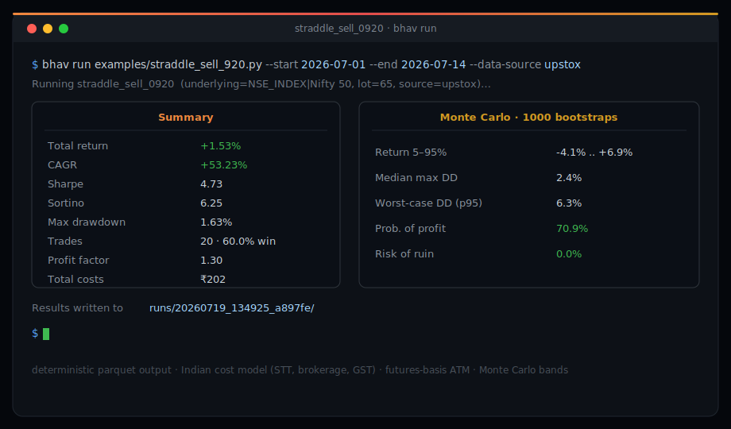
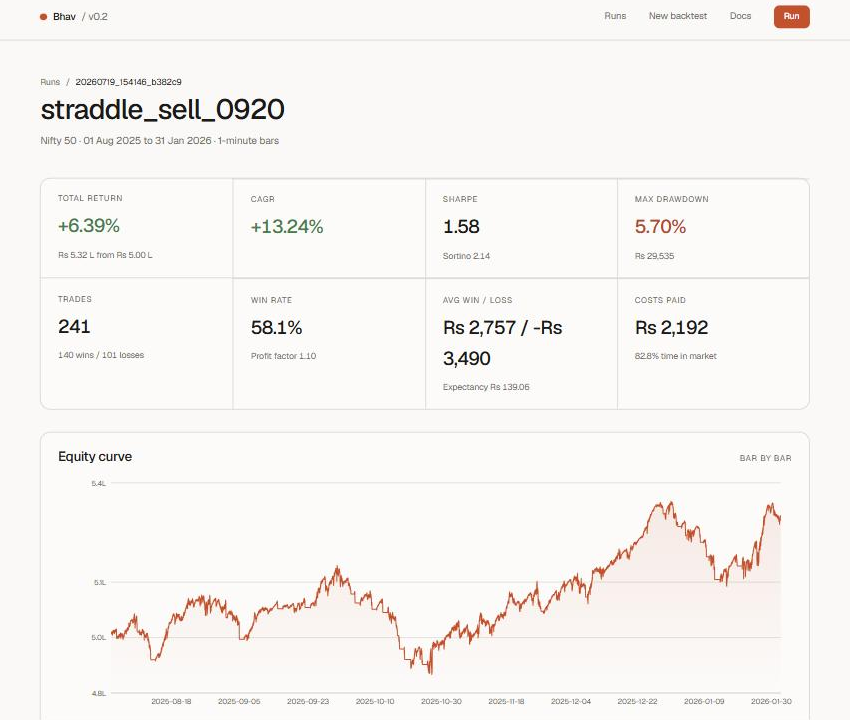

<div align="center">


# Bhav ( `bhav` )

**Open-source options backtesting engine for NSE (India).** Write a strategy in Python, run it against real 1-minute spot + option data, and get a deterministic Parquet result with a full metrics dashboard.

[Install](#install) · [Quickstart](#quickstart--cli) · [Generate with Claude](#generate-with-claude-no-api-key) · [Writing strategies](docs/writing-strategies.md) · [How it works](#how-it-works) · [License](#license)

<br/>



<sub>The <code>bhav</code> CLI — one command, deterministic Parquet output with a full metrics + Monte&nbsp;Carlo summary.</sub>

<br/><br/>



<sub>The web UI — KPI grid, equity curve, drawdown, P&amp;L distribution, and the full trade log.</sub>

<br/>

<em>Hindi / Marathi / Gujarati for “market rate” — what every Indian trader means by “aaj ka bhav kya hai?”</em>

</div>

Open-source and built specifically around Upstox's historical-data endpoints — expired option chains included, so you can backtest premiums for contracts that expired months or years ago, not just currently-listed ones.

- Bar-by-bar simulation on 1-minute NIFTY/BANKNIFTY/SENSEX (and other index) spot + option chain data
- Strategy API modeled on lifecycle hooks (`on_bar`, `on_day_start`, `on_day_end`, ...) — write plain Python, get deterministic Parquet output
- Pulls expired option contracts directly from Upstox's `expired-instruments` endpoints, so you can backtest premiums for contracts that expired months or years ago, not just currently-listed ones
- Realistic Indian cost model: STT (sell + exercised ITM), brokerage, exchange txn charge, SEBI charges, stamp duty, GST
- Engine-level `warmup_days` so lookback strategies (rolling S/R, moving averages) get correct history from day one of the window
- Futures-aware ATM selection: `--atm-reference futures` picks the ATM strike off the future (which NIFTY options actually price against) instead of the raw spot index, removing the basis bias — the front-month future is auto-rolled per day from Upstox's instrument master, so no per-expiry key to hand-feed (or pin one with `--futures-key`)
- Partial (tranche) closes: `ctx.close(key, lots=N)` peels off one slice of a position that accumulated from several entries, instead of dumping the whole key
- Local Parquet cache — every Upstox candle is fetched once, then reused across runs
- Per-underlying lot size / ATM-step table (NIFTY, BANKNIFTY, FINNIFTY, MIDCPNIFTY, NIFTYNXT50, SENSEX, BANKEX, SENSEX50) with auto-lookup
- FastAPI backend + Next.js frontend: upload a strategy file, set token/dates/capital, run a real backtest, see equity curve, drawdown, P&L distribution, and full trade log
- **Generate strategies with Claude, no API key** — `bhav generate "your idea"` (or the "Generate with Claude" panel on `/new`) drives the locally installed `claude` CLI to turn plain English into a contract-compliant strategy file
- **Static safety gate** — every uploaded or AI-generated strategy is scanned by an AST validator (`bhav/ai/validate.py`) that rejects `os`/`subprocess`/`eval`/`open`/network imports before the file is ever executed
- **Monte Carlo robustness** — each backtest bootstraps its trade sequence 1000× to report a 5–95% return band, worst-case (p95) drawdown, probability of profit, and risk of ruin
- No Upstox access? A bundled 1-year NIFTY sample dataset (`sample_data/nifty_1y_1min.xlsx`) lets anyone backtest offline with no token, any strategy: the bundled examples, hand-written, or AI-generated via `docs/ai-prompt.md`

## Status

**v0.2.** Multi-leg strategies now work: CE+PE combinations (straddles, strangles) and same-side multi-strike spreads (verticals, iron condors, ratios) in live Upstox mode — and offline wherever the bundled workbook carries a strike chain. Margin/SPAN modeling and multi-underlying portfolios are still to come. Upstox-only for live data; more brokers (Zerodha Kite, Angel One, Fyers, ...) are on the roadmap — the data layer (`bhav/data/upstox_client.py`) is a single swappable client, so adding another broker means implementing the same 4-endpoint interface, not touching the engine.

### New in v0.2

- **Generate strategies from plain English** with the local Claude CLI — no API key — gated by an AST validator that rejects unsafe code before it runs.
- **Monte Carlo robustness bands** on every run: return/drawdown confidence intervals, probability of profit, risk of ruin.
- **Futures-basis ATM** with per-day front-month **auto-roll** — `--atm-reference futures` removes the spot-vs-future basis bias without a hand-fed key.
- **Partial/tranche closes** — `ctx.close(key, lots=N)` scales out one slice of an aggregated position.
- **Strike-aware offline dataset** — same-side spreads are now testable without a broker account (bundled ±2 chain across June 2026; regenerate/widen with `scripts/build_sample_data.py`).

## Requirements

- Python 3.11+
- Node.js 20+ (only needed for the frontend)
- To backtest with live/full data: an Upstox Pro account with historical data API access, and an access token (expires daily around 03:30 IST — generate a fresh one each session)
- To try Bhav without a broker account: nothing extra. Use `--data-source excel` (CLI) or "Sample data" (web UI) to run against the bundled NIFTY dataset

## Install

One command (clones the repo, installs the Python package, installs frontend deps):

```powershell
npx @rajmaurya0904/create-bhav
```

Or manually:

```powershell
git clone https://github.com/rajmaurya0904/bhav.git
cd bhav

# backend
pip install -e .

# frontend (optional, only if you want the web UI)
cd frontend
npm install
```

## Quickstart — CLI

With a live Upstox token:

```powershell
$env:UPSTOX_TOKEN = "your_token"
bhav run examples/orb_v1.py --start 2025-08-01 --end 2025-11-30
```

Or with no broker account at all, using the bundled sample dataset:

```powershell
bhav run examples/orb_v1.py --start 2025-08-01 --end 2025-11-30 --data-source excel
```

Useful flags:

```
--underlying "NSE_INDEX|Nifty 50"   # default; see lot-size table below for others (upstox mode only)
--capital 500000                    # starting capital, default 500000
--lot-size 0                        # 0 = auto-lookup per underlying, or set explicitly
--warmup-days 3                     # pre-window replay so lookback strategies have history from day 1
--data-source upstox|excel          # default upstox; excel = bundled offline NIFTY dataset, no token needed
--excel-path path/to/file.xlsx      # only with --data-source excel; defaults to sample_data/nifty_1y_1min.xlsx
--atm-reference spot|futures        # default spot; 'futures' picks the ATM strike off the future, not spot
--futures-key "NSE_FO|..."          # optional; pin one future. Omit to auto-roll the front month per day (upstox mode only)
```

Results are written to `runs/<run_id>/` as `trades.parquet`, `equity_curve.parquet`, `metrics.json`, and `manifest.json` (with a SHA256 checksum of the metrics for reproducibility).

## Quickstart — Web UI

```powershell
# terminal 1: API server
bhav-server

# terminal 2: frontend
cd frontend
npm run dev
```

Open `http://localhost:3000`. Go to `/new`, upload a strategy `.py` file, pick a data source (Upstox live, or the bundled sample data — no token needed), set dates/underlying/capital/lot size/warmup days, and run. The results page polls until the run completes and shows total return, CAGR, Sharpe/Sortino, max drawdown, win rate, profit factor, expectancy, an equity curve, a drawdown curve, a P&L distribution, and the full trade log.

## Offline sample dataset

`sample_data/nifty_1y_1min.xlsx` bundles a year of NIFTY 50 data (Jul 2025-Jun 2026) so anyone can try Bhav without an Upstox account:

- `Spot_1min`: 1-minute NIFTY 50 spot candles
- `ATM_Options_1min`: 1-minute option candles (nearest weekly expiry). Most days carry the real ATM CE and PE; the most recent month (**June 2026**) carries a ±2-strike chain (ATM and two strikes either side) so multi-strike spreads are testable offline

`--data-source excel` (or the "Sample data" option in the web UI) works with **any** strategy file, not just the ones in `examples/` — hand-written, or generated by an AI following `docs/ai-prompt.md`. Point it at your own `.py` file exactly like you would with live Upstox data; the engine doesn't care where the strategy came from, only where the candles come from.

Strike coverage is whatever the workbook holds for each day. `strike_offset` in `ctx.buy_option()` is **honored on chain days** (so verticals/iron condors resolve to distinct strikes) and **falls back to the nearest available strike on ATM-only days** (so a same-side spread's legs collapse onto the ATM contract there). Good enough to validate strategy logic, spread mechanics, and cost modeling end to end; switch to `--data-source upstox` for the full chain on every day, other underlyings, and date ranges beyond what's bundled. Regenerate or widen the offline chain yourself with `scripts/build_sample_data.py` (needs a live token).

## Write your own strategy

A strategy is one Python file that exposes a `strategy` variable. Minimum viable example:

```python
from bhav.engine.strategy import Context, Strategy

class BuyATMCallAtOpen(Strategy):
    name = "buy_atm_call_at_open"

    def on_bar(self, ctx: Context) -> None:
        hhmm = f"{ctx.bar.timestamp.hour:02d}:{ctx.bar.timestamp.minute:02d}"
        if hhmm == "09:30" and not ctx.portfolio.positions:
            ctx.buy_option(option_type="CE", strike_offset=0, lots=1)

strategy = BuyATMCallAtOpen()
```

Full guide with API reference, worked examples, common patterns, and common mistakes (including the broker-candle-order gotcha): [docs/writing-strategies.md](docs/writing-strategies.md).

Don't want to write the Python yourself? [docs/ai-prompt.md](docs/ai-prompt.md) has a copy-pasteable prompt block that gets ChatGPT/Claude/Gemini to generate a strategy following Bhav's contract — the `/new` page in the frontend has the same prompt with a one-click copy button.

### Generate with Claude (no API key)

If you have [Claude Code](https://claude.com/claude-code) installed and signed in, Bhav can drive it for you — no `ANTHROPIC_API_KEY` needed. It shells out to the local `claude` CLI, feeds it the strategy contract plus your description, and writes back a validated `.py`:

```powershell
bhav generate "Sell an ATM straddle at 09:20. Cut both legs if the combined premium loss hits 30%. Otherwise hold to the 15:15 square-off." --out my_straddle.py
bhav run my_straddle.py --start 2025-08-01 --end 2025-09-30 --data-source excel
```

The `/new` page in the web UI has the same thing as a "Generate with Claude" panel: type your idea, click generate, review the code, and it's auto-attached to the run form. A CLI-connected / not-detected badge tells you whether the backend can reach `claude`.

Whether written by hand, generated, or uploaded, every strategy passes through an AST validator before it runs — a hallucinated `import os` or a stray `eval()` is rejected with a clear error rather than silently executed. It raises the bar; it is not a full sandbox, so still read AI-generated code before trusting it with real money.

### Reference strategies

All in [examples/](examples/), runnable as-is:

| File | Idea |
|---|---|
| [orb_v1.py](examples/orb_v1.py) | Opening-range breakout/fade on ATM options, SL/target/trailing-SL ladder, hard time exit |
| [morning_3min_momentum.py](examples/morning_3min_momentum.py) | First two 3-min candles at open; second candle's color picks CE/PE |
| [morning_momentum.py](examples/morning_momentum.py) | Point-move threshold from day open by 09:30 |
| [straddle_sell_920.py](examples/straddle_sell_920.py) | Short straddle sold shortly after open |
| [spike_fade.py](examples/spike_fade.py) | Fade a fast spot spike |

## Lot sizes (Jan 2026 revision)

| Underlying | Lot size | ATM step |
|---|---|---|
| NIFTY 50 | 65 | 50 |
| BANK NIFTY | 25 | 100 |
| FIN NIFTY | 65 | 50 |
| MIDCAP NIFTY | 120 | 25 |
| NIFTY NEXT 50 | 25 | 100 |
| SENSEX | 20 | 100 |
| BANKEX | 30 | 100 |
| SENSEX 50 | 60 | 100 |

Pass `--lot-size 0` (CLI) or leave lot size on auto (UI) to use this table automatically per underlying.

## How it works

1. `bhav.data.upstox_client.UpstoxClient` wraps Upstox's 4 relevant endpoints: `historical-candle` (spot), `expired-instruments/expiries`, `expired-instruments/option/contract`, `expired-instruments/historical-candle` (expired option premiums).
2. `bhav.data.cache.ParquetCache` caches every candle series to `~/.bhav/cache`, keyed by instrument + interval + date, always sorted ascending by timestamp.
3. `bhav.engine.bar_engine.BarEngine` replays 1-minute bars in order, calling your strategy's lifecycle hooks, optionally preceded by `warmup_days` of no-op replay so lookback state is built before live trading starts.
4. `bhav.engine.portfolio.Portfolio` tracks positions and realized trades, applying `bhav.engine.costs.IndianCostModel` on every fill.
5. `bhav.metrics.report` computes CAGR, Sharpe, Sortino, max drawdown, win rate, profit factor, and expectancy from the equity curve and trade log. `bhav.metrics.montecarlo` then bootstraps the trade sequence to produce return/drawdown confidence bands and risk of ruin.
6. `bhav.output.writer.ResultWriter` writes everything to `runs/<run_id>/` as Parquet + JSON (`trades`, `equity_curve`, `metrics`, `montecarlo`) with a manifest and checksum.

Strategy generation and safety live in `bhav.ai`: `prompt.py` (the canonical contract), `claude_generator.py` (the `claude` CLI subprocess wrapper), and `validate.py` (the AST gate applied to every strategy before execution).

## License

MIT.
